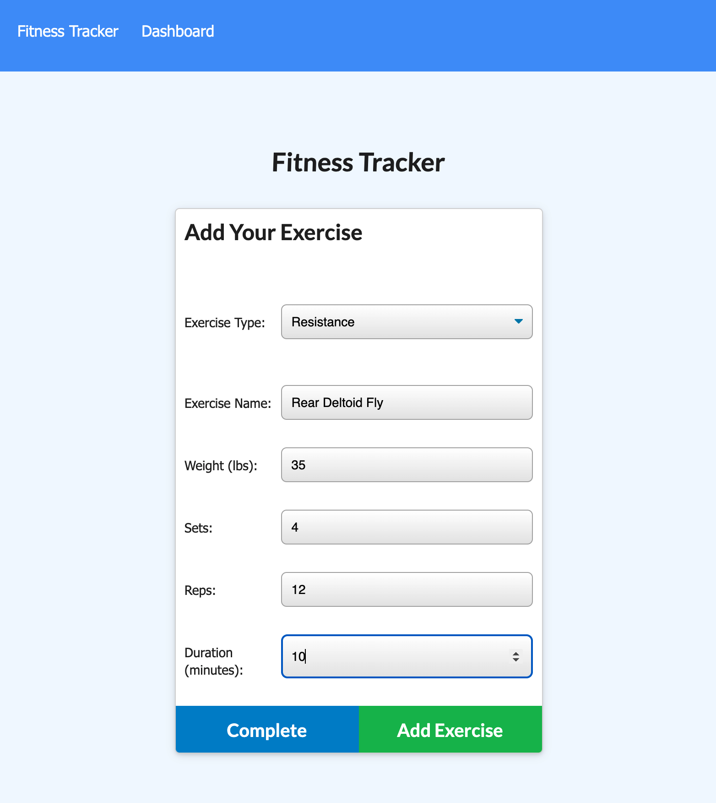

# Workout Tracker
Workout Tracker is a simple web application to create, view, and run light analytics on workouts. This application is great to keep track of progress and keep motivated as your maintain your workout routine. You're able to track the core components of any cardio and weight training (resistence) exercise, such as duration, distance, repetitions, and weight.

## Summary
[Click here to use the Workout Tracker application.](https://workout-tracker-211115.herokuapp.com/)

* On site load, user is presented with the option to create a new workout or continue with their last workout.
* The stats page allows for visbility into light analysis/aggregation of the last 7 workouts:
  * Ability to view the combined weight of multiple exercises 
  * Ability to view the total duration of each workout
* User has the ability to:
  * Add exercises to the most recent workout plan.
  * Add new exercises to a new workout plan.
* Workout Tracker uses a Mongo database with a Mongoose schema, and handles routing with Express.

### Landing Page
Either empty or showing data from the last workout if available. Starting point to create a new workout or add exercises to the current workout

### Dashboard 
Light exercise analytics from the last 7 workouts

### Workout Editor 
To add exercises to a new or an existing workout

## Installation
Ensure you have Node.js installed locally to install packages to and from the public npm registry. Node.js installation documentation.

1. Clone the repository to your local machine.

2. Install application dependencies `npm install`.
Required when when you first set up the project for local development or use OR if any changes are made to the project's dependencies. More Node information here.

3. From the root folder, add the seed data to your now established database with `npm run seed`

4. Start the application with `npm start` 

5. Open the website in your local browser at http://localhost:3000

## Technologies used
* [Mongo DB](https://www.mongodb.com/) - The NoSQL database used to support record storage.
* [Mongoose](https://www.npmjs.com/package/mongoose) - Mongoose is a MongoDB object modeling tool used for all models in this application.
* [Morgan](https://www.npmjs.com/package/morgan) - HTTP request logger middleware for Node.
* [Node](https://nodejs.org/en/) - Asynchronous event-driven JavaScript runtime environment that executes JavaScript code outside a web browser
* [NPM](https://www.npmjs.com/) - Node package manager, used in conjunction with JS and Inquirer to support application logic and Command Line interface.
* [Expressjs](https://expressjs.com/) - Leveraged for API's, utility methods, and middleware.
* [Chart.js](https://www.chartjs.org/) - Javascript charting
* [Javascript](https://developer.mozilla.org/en-US/docs/Web/javascript) - Core app logic
* [Bootstrap](https://getbootstrap.com/docs/5.0/getting-started/introduction/) - Style and icon framework.
* [Semantic UI](https://semantic-ui.com/) - Framework that uses CSS and jQuery to build user interfaces.
* [CSS](https://devdocs.io/css/) - Used to style html elements on the page as needed beyond Bootstrap.
* [HTML]((https://developer.mozilla.org/en-US/docs/Web/HTML) -Used to create elements on the DOM.
* [Git](https://git-scm.com/doc) - Version control system to track changes to source code.
* [GitHub](https://docs.github.com/en) - Hosts the code repository.

## Author
Sarah Hollingsworth
* [Github](https://github.com/sahhollingsworth)
* [LinkedIn](https://www.linkedin.com/in/sarahhollingsworth/)

## License
* Licensed under the [MIT](https://opensource.org/licenses/MIT) license.